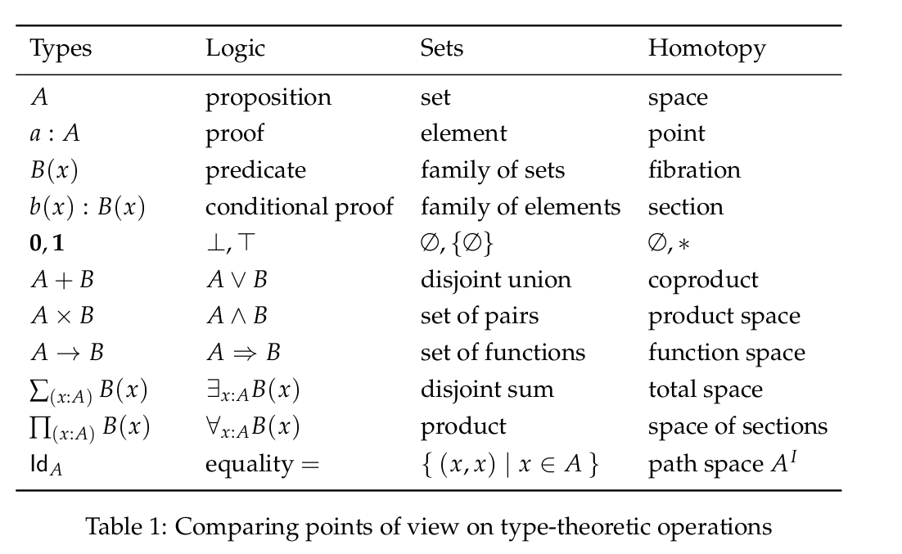

* Структура программ

В самом начале файла идут прагмы для интерпретатора, на них пока можно не обращать внимания
#+begin_src agda2

{-# OPTIONS --no-load-primitives #-}

#+end_src

Файлы содержат модули, должен быть хотя бы один с тем же именем, что у файла
#+begin_src agda2

module Day1 where

#+end_src

Импорты выглядят вот так
#+begin_src agda2

open import Prelude

#+end_src

Комментарии такие же, как в Haskell 
#+begin_src agda2
-- Однострочный комментарий
{- Многострочный
   комментарий
-}

#+end_src

* Как объявлять типы и функции
data ИМЯ_ТИПА : Type₀ where
  конструктор1 : ... → ИМЯ_ТИПА
  конструктор2 : ... → ИМЯ_ТИПА
  ...
Штука справа от имени типа называется *вселенной* (universe), на первое время нам хватит самой малой вселенной ~Type₀~
Можно писать 𝓤ₙ (чтобы напечатать такую штуку, вводите \MCU\_n) вместо Typeₙ

Например, определим булев тип:
#+begin_src agda2

-- Type\_0
-- \bB
data 𝔹 : Type₀ where
  false true : 𝔹

#+end_src
*Конструкторы* это способы создания элементов типа.
У ~𝔹~ два конструктора, оба не требуют аргументов. Здесь мы постановляем, что есть тип ~𝔹~, его можно сделать двумя различными способами: ~false~ и ~true~

Мнемоника простая, префикс \b значит blackboard, это чтобы напечатать символ так, как он выглядел бы на доске.
В университете и школе можно было видеть подобные символы для действительных чисел ℝ, рациональных ℚ итд

Давайте определим натуральные числа:
#+begin_src agda2

-- \bN
-- \->
data ℕ : Type where
  zero :     ℕ
  suc  : ℕ → ℕ
{-# BUILTIN NATURAL ℕ #-} -- чтобы можно было использовать литералы 0, 1 etc

#+end_src
У натуральных чисел тоже два конструктора, но их сигнатуры чуть сложнее.
У конструктора нет аргументов, можно считать, что мы ввели новое правило "ноль это натуральное число".
Если у кого был курс по матлогике, там это записывают в такой нотации (называется это *[[https://en.wikipedia.org/wiki/Sequent_calculus][исчислением секвенций]]* в стиле Генцена)

#+begin_src seq

──────────────
   ℕ : Type₀

──────────────
  zero : ℕ
  
#+end_src

Второй конструктор ~suc~ (successor, следующий) принимает один аргумент типа ~ℕ~. Это значит, что если у нас уже было какое-то
натуральное число ~n~, то ~suc n~ тоже натуральное число.

#+begin_src seq

   n : ℕ
──────────────
  suc n : ℕ
  
#+end_src

ИМЯ_ФУНКЦИИ : СИГНАТУРА
ИМЯ_ФУНКЦИИ конструктор1 аргумент2 ... = ТЕЛО_ФУНКЦИИ1
ИМЯ_ФУНКЦИИ конструктор2 аргумент2 ... = ТЕЛО_ФУНКЦИИ2
...

Итак, конструкторы позволяют нам создавать объекты разных типов, но нам ещё нужно с ними что-то полезное делать.
Использовать объекты можно только одним способом — с помощью функций. Функции задаются через pattern matching.
Давайте определим некоторые арифметические и логические функции:
#+begin_src agda2

_+_ : ℕ → ℕ → ℕ
zero  + y = y
suc x + y = suc (x + y)
infixr 5 _+_ -- инфиксный правоассоциативный оператор с приоритетом 5

#+end_src

* Mixfix operators
В агде нижнее подчёркивание не может быть частью имени, оно указывает, что в этой позиции функция желает видеть свой аргумент.
Функция ~_+_~ требует два аргумента, один слева от знака '+', другой справа. Такая гибкость позволяет использовать нотацию, мало отличающуюся
от используемой в статьях по математике и компьютерным наукам.

* Точки взаимодействия
Когда создаёте новую функцию, достаточно записать её имя и поставить знак '?' после равенства. Так создаются *точки взаимодействия*, они же *дырки*.
Этот механизм позволяет писать код интерактивно, постепенно его уточняя. В большинстве случаев написать нетривиальный код на агде с первой попытки без дырок
просто невозможно.

* Какие бывают взаимодействия

Самое частое, что нам понадобится:
~C-c C-l~ загрузить и проверить текущий файл
~C-c C-,~ показать текущий контекст и цель
~C-c C-c~ разобрать переменную на случаи (case analysis)
~C-c C-r~ уточнить результат (подбирает подходящий конструктор, если это можно сделать единственным способом)

Самая полезная команда :-)
~C-c C-a~ запустить автоматический поиск решения

Внутри дырки можно написать ответ руками, после этого нажать ~C-c C-SPC~, агда его проверит

#+begin_src agda2

_*_ : ℕ → ℕ → ℕ
zero  * _ = zero
suc x * y = y + x * y
infixr 6 _*_

not : 𝔹 → 𝔹
not false = true
not true  = false

_&&_ : (x : 𝔹) → (y : 𝔹) → 𝔹
false && _ = false
true  && y = y
infixr 5 _&&_

_||_ : (x : 𝔹) (y : 𝔹) → 𝔹
false || y = y
true  || _ = true
infixr 4 _||_

if_then_else_ : {A : Type₀} → (condition : 𝔹) → A → A → A
if false then _ else y = y
if true  then x else _ = x

#+end_src

Типы данных могут иметь параметры, например можно объявить полиморфные списки.
#+begin_src agda2

data List (A : Type₀) : Type₀ where
  []  :              List A
  _∷_ : A → List A → List A
infixr 4 _∷_

#+end_src

Списки в виде секвенций:
#+begin_src seq

     A : Type₀
──────────────────
   List A : Type₀

   A : Type₀
───────────────
   [] : List A

  A : Type₀     x : A     xs : List A
──────────────────────────────────────
           x ∷ xs : List A

#+end_src

* Неявные аргументы
Неявные аргументы записываются в фигурных скобках. При использовании функции с неявными аргументами, они будут выведены агдой автоматически,
если существует единственное решение. Эта же автоматика применяется, если вместо терма написать символ нижнего подчёркивания. Удобно, когда
не хочется писать руками очевидный (в формальном смысле) ответ.

#+begin_src agda2

length : {A : Type₀} → List A → ℕ
length []       = 0
length (_ ∷ xs) = suc (length xs)

_++_ : {A : Type₀} → (xs ys : List A) → List A
[]       ++ ys = ys
(x ∷ xs) ++ ys = x ∷ xs ++ ys
infixr 7 _++_

-- headₗ : {A : Type₀} → List A → A
-- headₗ [] = {!!} -- такая функция невозможна
-- headₗ (x ∷ _) = x

tailₗ : {A : Type₀} → List A → List A
tailₗ []       = []
tailₗ (_ ∷ xs) = xs

-- lookupₗ : {A : Type₀} → (index : ℕ) → List A → A
-- lookupₗ index xs = {!!} -- такая тоже

#+end_src

* Зависимые типы
Самый цимес, киллер фича агды и подобных языков.

Отступление про лямбда-куб:
  - функции позволяют значениям зависеть от других значений
  - параметрический полиморфизм позволяет типам зависеть от других типов (как в примере со списком)
  - значения могут зависеть от типов (например, с помощью тайпклассов в хаскелле можно такое сделать)
  - в агде типы могут зависеть от значений

Всем надоевший пример со списками, проиндексированными длиной, т.е. векторами.
Такое определение называется *зависимым типом* или *семейством типов*, тк оно задаёт не один новый тип, а сразу целый набор, по одному
для каждого элемента ℕ: Vec A 0, Vec A 1, Vec A 2 ...
#+begin_src agda2

data Vec (A : Type₀) : ℕ → Type₀ where
  []  :                         Vec A 0
  _∷_ : {n : ℕ} → A → Vec A n → Vec A (suc n)

headᵥ : {A : Type₀} {n : ℕ} → Vec A (suc n) → A
headᵥ (x ∷ _) = x

tailᵥ : {A : Type₀} {n : ℕ} → Vec A (suc n) → Vec A n
tailᵥ (_ ∷ xs) = xs

#+end_src

Как выглядят векторы и конечные типы на секвентах:
#+begin_src seq

  A : Type₀    n : ℕ
──────────────────────
   Vec A n : Type₀

     A : Type₀
──────────────────
    [] : Vec A 0

  A : Type₀      n : ℕ      v : A      vs : Vec A n
──────────────────────────────────────────────────────
                  v ∷ vs : Vec A (suc n)

        n : ℕ
────────────────────────
    fzero : Fin (suc n)

  n : ℕ      k : Fin n
────────────────────────
    fsuc k : Fin (suc n)

#+end_src

Научимся корректно доставать элементы по индексу из векторов, для этого сначала создадим нужный тип для индексов:
#+begin_src agda2

data Fin : ℕ → Type₀ where
  fzero : {n : ℕ}         → Fin (suc n)
  fsuc  : {n : ℕ} → Fin n → Fin (suc n)

finEx₁ : Fin 2
finEx₁ = fzero

finEx₂ : Fin 2
finEx₂ = fsuc fzero

lookupᵥ : {A : Type₀} {n : ℕ} → (index : Fin n) → Vec A n → A
lookupᵥ fzero        (x ∷ _)  = x
lookupᵥ (fsuc index) (_ ∷ xs) = lookupᵥ index xs

#+end_src

* Идентичность/равенство
Понятие очень глубокое, если кто хочет детально разобраться, милости прошу на [[https://ncatlab.org/nlab/show/equality][нлаб]] или в [[https://homotopytypetheory.org/book/][hott-book]].

/Пропозициональное равенство/ в агде можно определить как семейство, индексированное двумя копиями любого типа ~A~.
Конструктор единственный, который для любого элемента ~x : A~ утверждает, что ~x~ равен самому себе.
#+begin_src agda2

-- \==
data _≡_ {ℓ} {A : Type ℓ} : A → A → Type ℓ where
  refl : (x : A) → x ≡ x
infix 0 _≡_
{-# BUILTIN EQUALITY _≡_ #-}

_ : 6 + (7 * 5) ≡ 41
_ = refl 41

#+end_src

Равенство сохраняется, если на обе части подействовать любой функцией.
Равенство является отношением эквивалентности, т.е. оно рефлексивно, симметрично и транзитивно.
#+begin_src agda2

cong : {A B : Type₀} (f : A → B) {x y : A} → x ≡ y → f x ≡ f y
cong f (refl _) = refl (f _)

sym : {A : Type₀} {x y : A} → x ≡ y → y ≡ x
sym (refl _) = refl _

trans : {A : Type₀} {x y z : A} → x ≡ y → y ≡ z → x ≡ z
trans p (refl _) = p

#+end_src

* Соответствие Карри-Говарда-Ламбека
Формально связь между теорией типов, матлогикой и теорией категорий была установлена вышеназванными чуваками.
Проще всего взглянуть на [[https://ncatlab.org/nlab/show/computational+trilogy][табличку]].

Также можно почитать про [[https://ncatlab.org/nlab/show/Brouwer-Heyting-Kolmogorov+interpretation][интерпретацию Броуэра-Гейтинга-Колмогорова]] для интуиционистской логики.

Давайте посмотрим на ложь, истину, "и", "или", "не", импликацию, кванторы "для всех" и "существует"
#+begin_src agda2

data ⊥ : Type₀ where

ex-falso-quodlibet : {A : Type₀} → ⊥ → A
ex-falso-quodlibet ()

record ⊤ : Type₀ where
  constructor tt

-- data ⊤ : Type₀ where
--   tt : ⊤

_∧_ : Type₀ → Type₀ → Type₀
A ∧ B = A × B
infixr 6 _∧_

data _∨_ (A B : Type₀) : Type₀ where
  inj₁ : A → A ∨ B
  inj₂ : B → A ∨ B
infixr 5 _∨_

¬_ : Type₀ → Type₀
¬ A = A → ⊥

_⇒_ : Type₀ → Type₀ → Type₀
P ⇒ Q = P → Q
infixr 3 _⇒_

_⇔_ : Type₀ → Type₀ → Type₀
P ⇔ Q = (P ⇒ Q) ∧ (Q ⇒ P)

#+end_src
